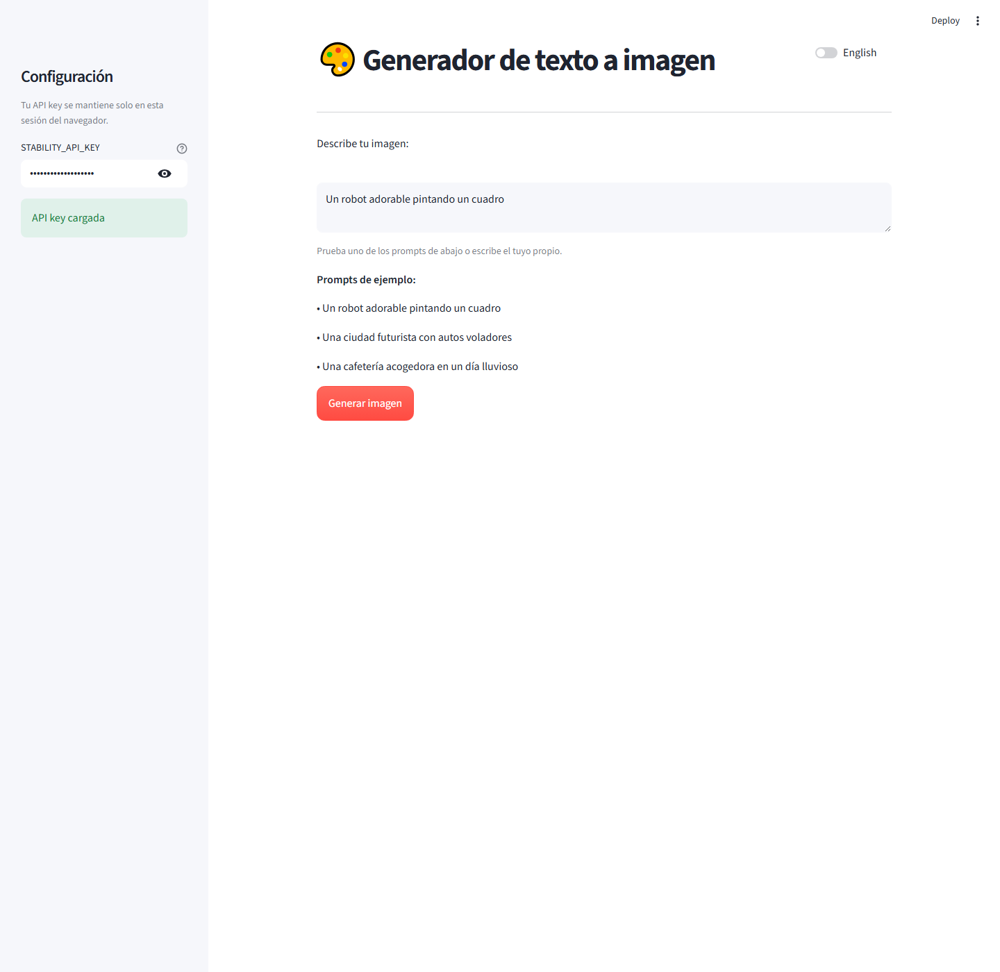

# Text Image Generator


Simple Streamlit app that turns text prompts into AI-generated images with Stability AI.



## Features

- Spanish by default with an English/Spanish switch
- Sidebar field for each user to enter `STABILITY_API_KEY`
- Text prompt input
- Stability AI text-to-image integration
- Inline image preview
- Download button for generated PNGs
- Sidebar-only API key loading

## Setup

1. Install dependencies:

```bash
python -m venv .venv
.venv\Scripts\python -m pip install -r requirements.txt
```

2. Run the app:

```bash
.venv\Scripts\streamlit run app.py
```

## Security Notes

- Do not commit `.streamlit/secrets.toml` or any file containing API keys.
- Keep `.venv/` out of Git. The included `.gitignore` already excludes it.
- The sidebar key input is session-only and does not write secrets to disk.

## Example prompts

- A cute robot painting a picture
- A futuristic city with flying cars
- A cozy coffee shop on a rainy day
